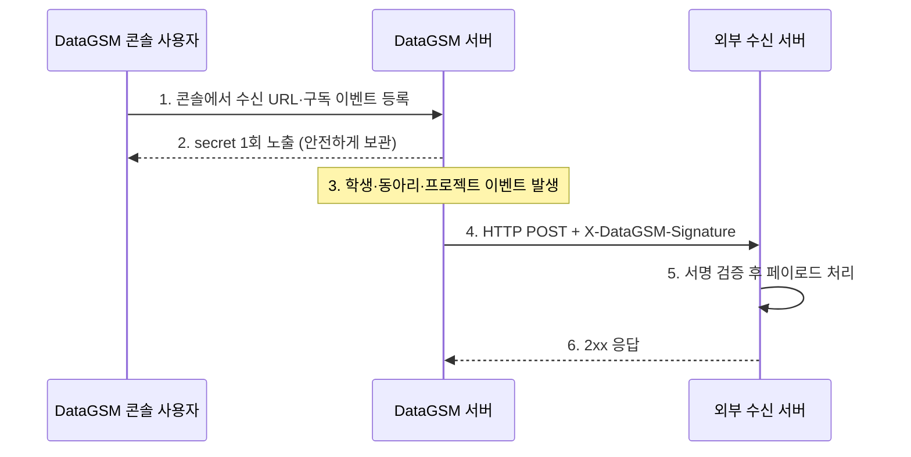

import { Shield } from 'lucide-react'

export const metadata = { title: 'Event' }

# Event

### 개요

DataGSM Event는 학생, 동아리, 프로젝트 도메인에서 발생하는 이벤트를 외부 서버로 실시간 전달하는 기능입니다. 이벤트가 발생하면 등록한 수신 URL로 HTTP POST 요청이 비동기로 발송되므로, 외부 서버가 DataGSM 데이터를 주기적으로 폴링하지 않아도 변경 사항을 즉시 반영할 수 있습니다.

### 사용 시나리오

- 학생이 졸업·자퇴 처리되었을 때 외부 알림 시스템에 자동 통지
- 동아리가 생성·수정·삭제될 때 외부 서비스의 동아리 데이터 동기화
- 프로젝트 변경 사항을 외부 대시보드에 실시간 반영

### 동작 방식

### 지원 이벤트

현재 지원되는 이벤트는 다음과 같습니다.

| 이벤트                      | 트리거          | 관련 도메인  |
|--------------------------|--------------|---------|
| `student.graduated`      | 학생 졸업 처리     | student |
| `student.withdrawn`      | 학생 자퇴 처리     | student |
| `student.status_changed` | 학생 상태 변경     | student |
| `club.created`           | 동아리 생성       | club    |
| `club.updated`           | 동아리 정보 수정    | club    |
| `club.deleted`           | 동아리 삭제       | club    |
| `project.created`        | 프로젝트 생성      | project |
| `project.updated`        | 프로젝트 수정      | project |
| `project.deleted`        | 프로젝트 삭제      | project |

각 이벤트의 payload 형식은 [이벤트 페이로드 명세](/event/payloads)에서 확인할 수 있습니다.

### 등록 가능 개수

하나의 계정에는 최대 **10개**의 Event를 등록할 수 있습니다. 이미 10개를 등록한 경우 콘솔의 등록 버튼이 비활성화됩니다.

### 전송 정책

| 항목               | 정책                                                           |
|------------------|--------------------------------------------------------------|
| **전송 방식**        | 비동기 HTTP POST 요청                                             |
| **재시도**          | 최대 3회, 지수 백오프 (1s → 10s → 60s)                               |
| **서명 헤더**        | `X-DataGSM-Signature: sha256=<HMAC-SHA256(secret, payload)>` |
| **Content-Type** | `application/json`                                           |

3회 재시도 후에도 전달에 실패하면 해당 이벤트는 영구적으로 손실됩니다. 수신 서버가 일시적으로 다운된 상태에서 발생한 이벤트는 재발송되지 않으므로, 중요한 데이터는 별도의 정합성 점검 로직을 함께 운영하는 것을 권장합니다.

### secret 관리

  

    <Shield className="h-5 w-5 text-blue-600 dark:text-blue-500 shrink-0 mt-0.5" />
    

      

        secret은 등록 시 단 한 번만 노출됩니다
      

      

        Event 등록에 성공하면 표시되는 <code className="mx-1 px-1.5 py-0.5 bg-blue-100 dark:bg-blue-800 rounded">secret</code>은 등록 완료 화면에서 단 한 번만 확인할 수 있습니다. 창을 닫은 이후에는 목록에서 다시 확인할 수 없으며, 분실 시 해당 Event를 삭제하고 다시 등록해야 합니다.
      

    

  

secret은 64자 hex 문자열이며, 수신 서버가 위조 요청을 식별하기 위한 HMAC-SHA256 서명 키로 사용됩니다. 서명 검증 방법은 [서명 검증 가이드](/event/signature)를 참고하세요.

### 빠른 시작

1. DataGSM 웹에 로그인한 뒤 [Event 콘솔](https://www.datagsm.kr/events)에서 수신 URL과 구독 이벤트를 등록합니다.
2. 등록 완료 화면에 노출된 `secret`을 안전한 곳에 즉시 보관합니다.
3. 수신 서버에서 `X-DataGSM-Signature` 헤더를 검증하여 요청의 진위를 확인합니다.

### 다음 단계

- [이벤트 페이로드 명세](/event/payloads)
- [서명 검증 가이드](/event/signature)
